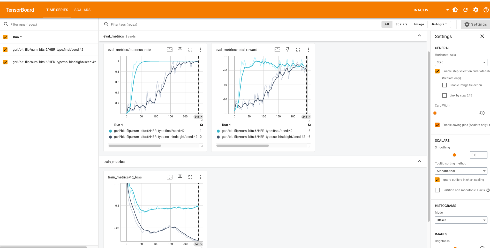
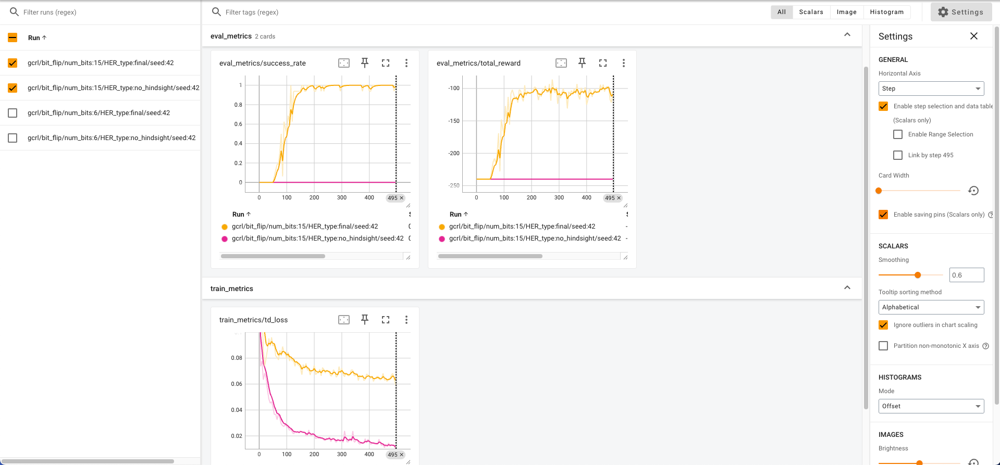
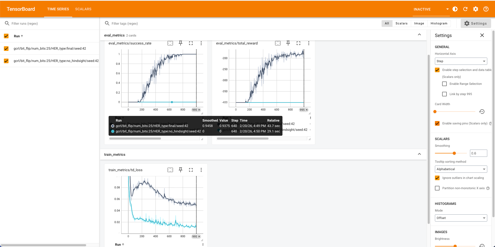
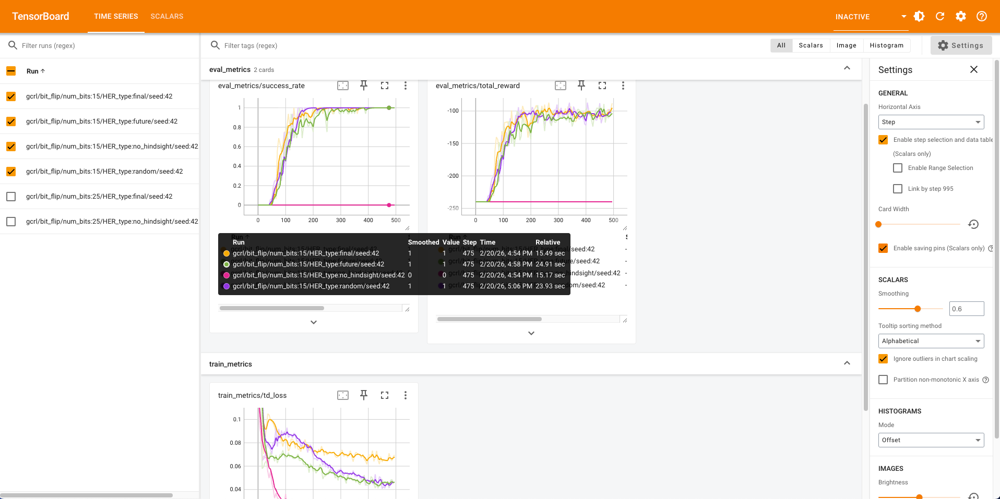
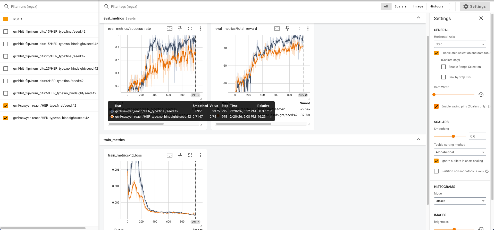

# Setup
Make sure that you have used the given AMI to create a c4.4xlarge instance with 60gb of storage. Follow the CS 224R AWS Guide which has instructions for setting up and accessing an AWS spot instance.

SSH into the virtual machine. There should already be a hw4 folder in the default directory. Conda should already be installed and you should see the "(base)" text on the left of the terminal.

To get working on the goal_conditioned portion you just need to activate the respective gcrl conda environment
```bash
conda deactivate
conda activate gcrl
```

# runs

a Run the following commands:
python main.py --env=bit_flip --num_bits=6 --num_epochs=250 --her_type no_hindsight
python main.py --env=bit_flip --num_bits=6 --num_epochs=250 --her_type final




b Run the following commands:
python main.py --env=bit_flip --num_bits=15 --num_epochs=500 --her_type no_hindsight
python main.py --env=bit_flip --num_bits=15 --num_epochs=500 --her_type final




c Run the following commands:
python main.py --env=bit_flip --num_bits=25 --num_epochs=1000 --her_type no_hindsight
python main.py --env=bit_flip --num_bits=25 --num_epochs=1000 --her_type final



d Finally, we will compare the three versions of HER, with the baseline of not using
HER:
// python main.py --env=bit_flip --num_bits=15 --num_epochs=500 --her_type no_hindsight
// python main.py --env=bit_flip --num_bits=15 --num_epochs=500 --her_type final
python main.py --env=bit_flip --num_bits=15 --num_epochs=500 --her_type random
python main.py --env=bit_flip --num_bits=15 --num_epochs=500 --her_type future



If implemented correctly, HER should work for the second environment, Sawyer Reach.
Compare the performance of the Sawyer arm with and without HER. Run the following
commands:
python main.py --env=sawyer_reach --num_epochs=1000 --her_type no_hindsight
python main.py --env=sawyer_reach --num_epochs=1000 --her_type final


